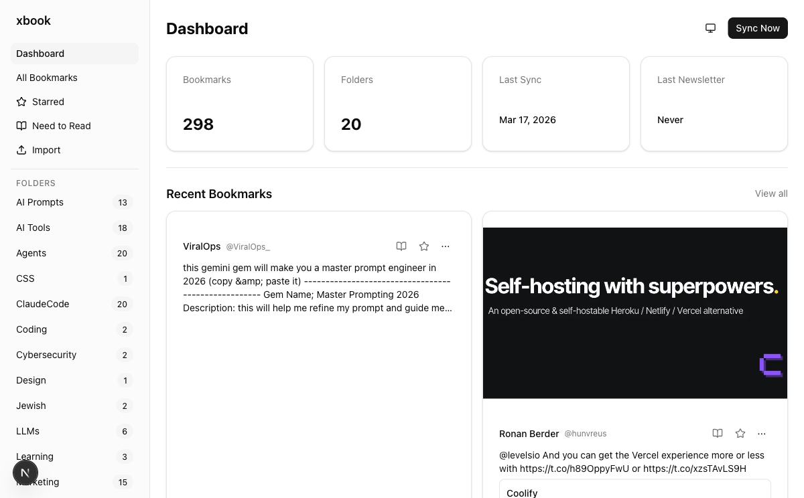
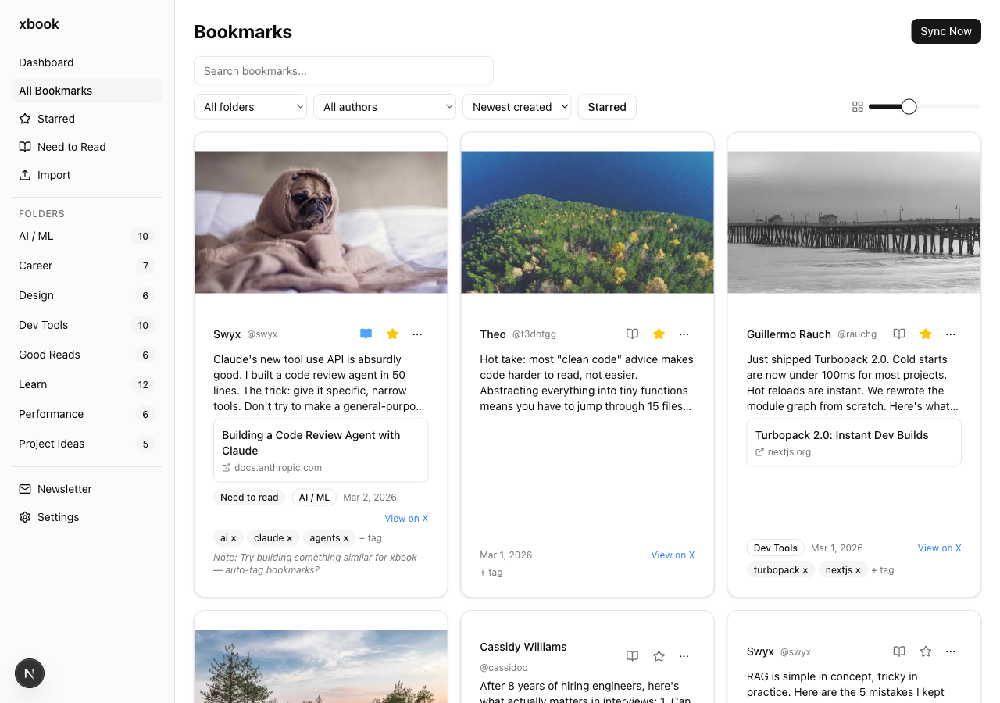
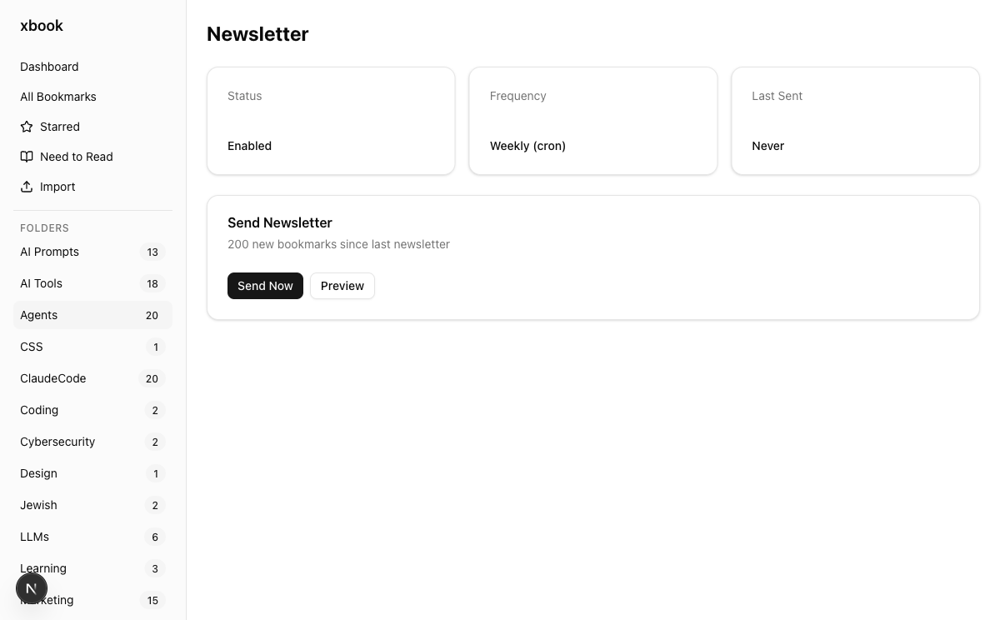

# xbook

[](LICENSE)
[]()
[]()
[]()

Sync your X bookmarks, search and organize them, and get a weekly email digest with what you saved.

<!-- TODO: Add dashboard screenshot here -->
<!--  -->

---

**You bookmark tweets to come back to later. You don't come back enough. Good stuff gets buried.**

xbook pulls your bookmarks into a local database you can search, and emails you once a week with what you saved. The bookmarks come to you instead of sitting there waiting.

## Features

- **Sync** — Pull bookmarks from X automatically, including folder assignments
- **Import** — Load bookmarks from JSON or CSV (for full history beyond the API's ~100 limit)
- **Browse** — Search, filter by folder/author/tags, add notes and tags per bookmark
- **Newsletter** — Weekly email digest of new bookmarks via Resend
- **Scheduled** — Run sync + newsletter on a cron for hands-off operation
- **Self-hosted** — Single Docker container, SQLite, your data stays on your machine

## Quick Start (Docker)

```bash
git clone https://github.com/joedanz/xbook.git
cd xbook
cp .env.example .env
# Edit .env with your X_CLIENT_ID and X_CLIENT_SECRET
docker compose up -d
```

Open [http://localhost:3000/dashboard](http://localhost:3000/dashboard) and click **"Connect X Account"** to link your X account.

> You'll need an [X Developer account](https://developer.x.com) with OAuth 2.0 credentials. See the [X Developer setup guide](docs/x-developer-setup.md) for a walkthrough.

<details>
<summary><strong>Self-Hosting Details</strong></summary>

xbook runs as a single Docker container with SQLite for storage. Data is persisted in a named volume at `/data/xbook.db`.

**Requirements:**
- Docker and Docker Compose
- X Developer account with OAuth 2.0 credentials

The SQLite database is stored in a Docker volume (`xbook-data`) and persists across restarts.

### Upgrading

Pull the latest and restart. Migrations run automatically on startup.

```bash
git pull
docker compose build
docker compose up -d
```

Your data is safe in the `xbook-data` Docker volume across upgrades.

</details>

<details>
<summary><strong>Local Development</strong></summary>

**Prerequisites:**
- Node.js 20+
- [X Developer account](https://developer.x.com) with OAuth 2.0 (PKCE)
- [Resend](https://resend.com) account (optional, for newsletters)

**Setup:**

```bash
git clone https://github.com/joedanz/xbook.git && cd xbook
npm install
cd web && npm install && cd ..
cp .env.local.example .env.local
# Edit .env.local with your credentials
cp .env.local web/.env.local
```

| Variable | Required | Description |
|----------|----------|-------------|
| `X_CLIENT_ID` | Yes | OAuth 2.0 Client ID from X Developer Portal |
| `X_CLIENT_SECRET` | Yes | OAuth 2.0 Client Secret |
| `RESEND_API_KEY` | No | For email newsletter digest |
| `NEWSLETTER_TO` | No | Newsletter recipient email |

**Run:**

```bash
cd web && npm run dev    # Web UI at http://localhost:3000
npm test                 # Run tests
npm run build            # Build CLI
```

**Upgrading:**

```bash
git pull
npm install
cd web && npm install && cd ..
```

Migrations run automatically on startup.

</details>

## CLI Commands

| Command | Description |
|---------|-------------|
| `xbook login [api-key]` | Authenticate with an xbook API key (or set `XBOOK_API_KEY` env var) |
| `xbook logout` | Clear saved API key |
| `xbook sync` | Sync bookmarks from X |
| `xbook import <file>` | Import bookmarks from JSON or CSV (`--dry-run` to validate) |
| `xbook bookmarks` | List bookmarks (`--search`, `--folder`, `--author`, `--tags`, `--starred`, `--page`, `--page-size`) |
| `xbook folders` | List bookmark folders |
| `xbook stats` | Show bookmark statistics |
| `xbook status` | Check server status and connection |
| `xbook newsletter` | Send or preview newsletter (`--dry-run` to preview) |
| `xbook serve` | Run sync + newsletter on a cron (`--cron`, `--sync-only`, `--newsletter-only`) |

All commands support `--json` for machine-readable output and `--api-url` to override the API URL.

## Screenshots

<!-- TODO: Add screenshots after capturing -->
<!--  -->
<!--  -->
<!--  -->

## Web Interface

<!-- TODO: Add web UI screenshot here -->
<!--  -->

Start the dev server and open [http://localhost:3000/dashboard](http://localhost:3000/dashboard):

- Dashboard with stats and recent bookmarks
- Full bookmark list with search, folder/author filters, and sort
- Import bookmarks from JSON/CSV file uploads
- Per-bookmark notes and tags
- Move bookmarks between folders

## Architecture

```
xbook/
├── src/           CLI commands (login, sync, import, serve)
├── shared/        Types, schema, repository, encryption, auth
├── web/           Next.js web interface
│   ├── app/       Pages and API routes
│   ├── components shadcn/ui components
│   └── lib/       Server actions and DB singleton
└── tests/         Vitest test suite
```

The CLI and web interface share the same SQLite database and auth tokens.

## Documentation

- [API Reference](docs/api-reference.md) — REST API endpoints, authentication, and response formats
- [Import Formats](docs/import-formats.md) — Supported file formats for bookmark imports
- [Environment Variables](docs/environment-variables.md) — Complete env var reference
- [Troubleshooting](docs/troubleshooting.md) — Common issues and solutions

## Contributing

Contributions are welcome! Please open an issue or pull request on GitHub.

1. Fork the repo and create a feature branch
2. Make your changes with tests where applicable
3. Run `npm test` and `cd web && npm test` to verify
4. Open a PR against `main`

## License

Licensed under [FSL-1.1-MIT](LICENSE) (Functional Source License, Version 1.1, MIT Future License).

- Free to self-host, modify, and use for any non-competing purpose
- Cannot be used to offer a competing commercial service
- Automatically converts to MIT after 2 years per version

See [fsl.software](https://fsl.software) for details.
